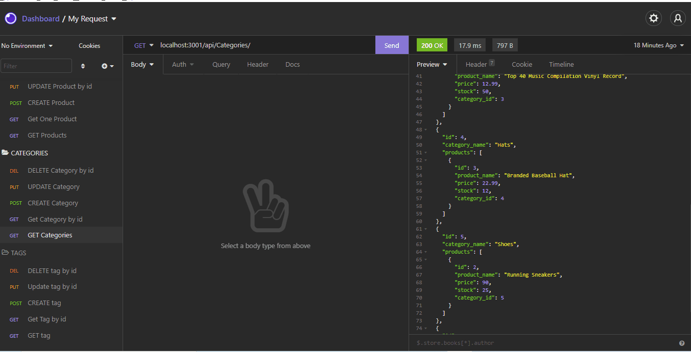

# E-Commerce-Back End

# Description
Internet retail, also known as **e-commerce**, is the largest sector of the electronics industry, generating an estimated $29 trillion in 2019. E-commerce platforms like Shopify and WooCommerce provide a suite of services to businesses of all sizes. Due to their prevalence, understanding the fundamental architecture of these platforms will benefit you as a full-stack web developer.This project is the creation of the back end for an e-commerce site. This application used Express.js API and Sequelize to interact with a MySQL database. This application displays creation of database using mySQL with models and associations. Then demonstrates the API Routes to perform RESTful CRUD operations displayed in my walk through videos.

## Table of Contents
* [Installation](#installation)
* [Usage](#usage)
* [Demo](#demo)
* [License](#license)
* [Contributor](#contributor)

## Installation

1. Clone and install dependencies:

```typescript
$ git clone git@github.com:ebazazzadeh/e-commerce.git
$ cd E-Commerce-BackEnd
$ npm install
```
2. Add `.env`file and add the following by updating placeholder values:

```
DB_NAME='ecommerce_db'
DB_USER='YOUR_USERNAME'
DB_PW='YOUR_PASSWORD'
```

3. Add database:

```
  $ mysql -u  root -p
  mysql> source db/schema.sql
  mysql> show databases
  mysql> exit;
```

4. Seed database:

```
  $ npm run seed
```

## Usage

1. To run in prod mode:

```typescript
$ npm start
```

## Demo



## License 
This project is license under MIT

## Contributor

Elham Bazazzadeh @2021